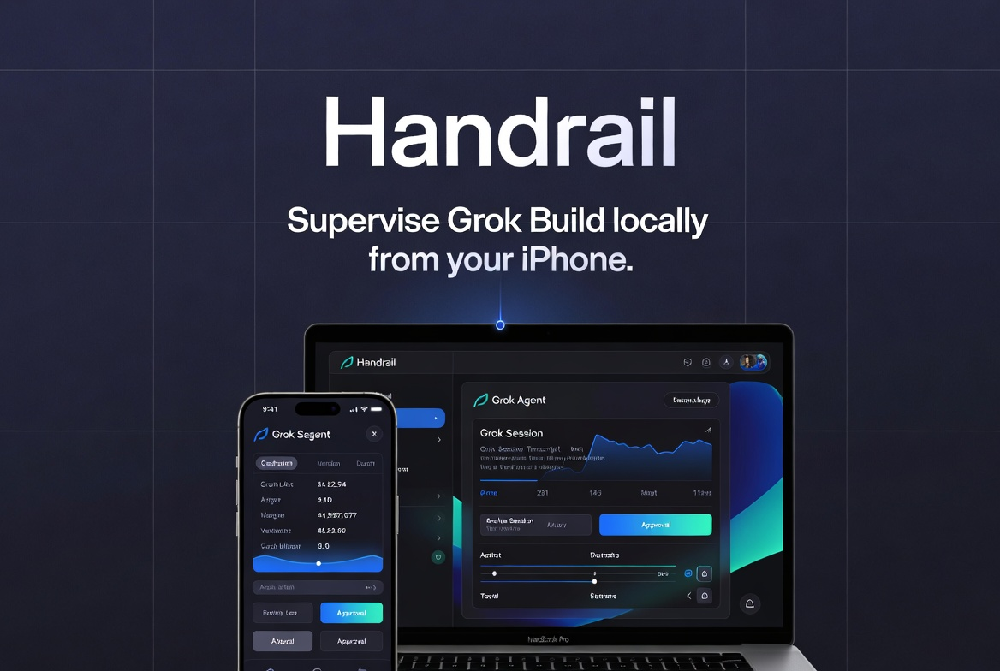

<p align="center">
  
</p>

# Handrail

**Supervise Grok Build from your iPhone — locally, on your own Mac.**

Handrail is a free, local-first companion for the Grok Build CLI. It pairs your iPhone with a small CLI on your Mac so you can list sessions, read transcripts, send follow-ups, approve tool requests, and stop running work — without a cloud relay, account, or subscription.

Handrail is not affiliated with xAI.

## Overview

Handrail has two components:

| Component | Role |
|-----------|------|
| **handrail** (CLI) | Runs on your Mac. Starts a local WebSocket server, reads Grok session state from `~/.grok/sessions`, and drives Grok through the ACP stdio protocol. |
| **Handrail** (iOS) | SwiftUI app for iPhone and iPad. Pairs over your LAN, mirrors chat state from the Mac, and sends commands back to the CLI. |

Grok Build remains the authority for execution. Handrail supervises it; it does not replace the Grok CLI or edit files directly from iOS.

## Features

- **Pair once, stay local** — QR pairing over Wi‑Fi/LAN; no Handrail account or cloud backend.
- **Session list and detail** — Titles, status, transcripts (`User:` / `Grok:` / `Tool:`), and project context from live Grok sessions.
- **Continue and start chats** — Send prompts from iOS; the Mac runs Grok via ACP.
- **Tool approvals** — Surface `session/request_permission` requests with summary and file context; approve or deny from the phone.
- **Stop in flight** — Request interruption of a running turn from iOS.
- **Notifications** — Optional local alerts for completion, failure, and approval-required states (APNs optional on the Mac side).

## Requirements

**Mac**

- Node.js 20+
- Grok Build CLI installed and authenticated (`grok login`)
- Same network as your iPhone (or routable LAN)

**iPhone / iPad**

- Xcode 16+ to build from source
- Camera for QR pairing (physical device recommended)

## Quick start

### 1. Install the CLI

```sh
cd cli
npm install
npm run build
npm link
```

### 2. Pair your phone

On the Mac:

```sh
handrail pair
```

This writes pairing state to `~/.handrail/state.json`, prints a QR code, and starts the WebSocket server (default port `8787`).

On iOS, open Handrail, scan the QR code, and confirm the connection. The payload includes protocol version, host, port, pairing token, and machine name.

### 3. Supervise sessions

With the server running (`handrail pair` or `handrail serve`):

```sh
handrail chats          # list grok:<session-id> chats
handrail stop <chat-id> # request stop for a running session
```

Open the iOS app to browse sessions, view transcripts, continue idle chats, and handle approvals.

### 4. Build the iOS app

```sh
open ios/Handrail/Handrail.xcodeproj
```

Select the **Handrail** scheme and run on a simulator or device.

## CLI reference

| Command | Description |
|---------|-------------|
| `handrail pair` | Create or reuse pairing token, show QR, start server |
| `handrail serve` | Start server without QR flow |
| `handrail chats` | Print session list from Grok state |
| `handrail stop <id>` | Interrupt a running Grok turn |
| `handrail unpair` | Clear local pairing state |

Chat IDs use the `grok:<session-id>` prefix, sourced from `~/.grok/sessions`.

## Architecture

```text
iPhone / iPad  ── ws:// (LAN) ──►  handrail CLI  ── ACP stdio ──►  grok agent
                                         │
                                         ├── ~/.grok/sessions/**/summary.json
                                         ├── updates.jsonl (transcripts)
                                         └── active_sessions.json (live status)
```

The CLI speaks JSON over WebSocket to iOS and JSON-RPC over stdio to Grok. Protocol details: [docs/spec/handrail-websocket-protocol.md](docs/spec/handrail-websocket-protocol.md) and [docs/spec/grok-build-adapter.md](docs/spec/grok-build-adapter.md).

## Security and privacy

Handrail is designed for trusted local networks:

- **Authentication** — Per-device pairing token (Keychain on iOS; `~/.handrail/state.json` on Mac).
- **Transport** — `ws://` on LAN (not TLS). Protect the network you use.
- **Data** — Chat content stays on your machines. Handrail does not operate a sync or analytics backend.

Full policy: [docs/privacy-policy.md](docs/privacy-policy.md)

## Development

```sh
cd cli
npm test                 # unit tests (60)
npm run spike            # Grok adapter feasibility probes
npm run e2e              # live WebSocket probe; requires handrail serve
```

Agent and contributor conventions: [AGENTS.md](AGENTS.md). Migration and engineering history: [docs/REVIVAL.md](docs/REVIVAL.md).

## Scope and limitations

Handrail intentionally does **not** provide a cloud IDE, generic SSH terminal, multi-agent control plane, or support for non-Grok agents. Automations are not available in the current release.

Other constraints worth knowing before production use:

- WebSocket traffic is unencrypted (`ws://`).
- Approval workflows need live device validation before App Store claims.
- Push notifications require APNs configuration on the Mac (`HANDRAIL_APNS_*` env vars).
- Handrail does not maintain a separate chat database; Grok session files are the source of truth.

## License

Handrail is free, local-first software for personal use with Grok Build on your own hardware.